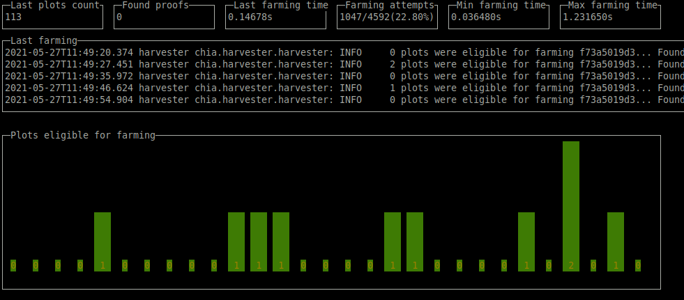

# Chia log analyzer
Simply realtime chia log analyzer

## Howto run
```
chia-log-analyzer.go-linux-amd64 --log=/path/to/debug.log
```
or simply copy binary file to the directory with logs and run without parameters



## Howto install
Download binary from the [releases](../../releases) assets

## Features
- monitoring of chia debug.log file
- simply show basic info about farming
- automatic refresh every 5s

## Supported platforms
- Linux (tested on Ubuntu)
- RPI4 (use linux-arm builds)
- Windows10

## Keys
- **q** - exit

## Donations
Thank you...

**Chia coins (XCH)** - xch16agqsnzhrf55x0f4f7y8k0kq9xz6rvh99nfd86cc3lnse8kgn5qs5y6ywn

**Bitcoin** - 3GvUQUPPbp396jYoZsAMktgg5XWE9g6con