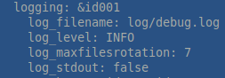

[](https://goreportcard.com/report/github.com/kubec/chia-log-analyzer)
[](https://raw.githubusercontent.com/kubec/chia-log-analyzer/master/LICENSE)

# Chia log analyzer
Simply realtime chia log analyzer


## Howto run on Linux
0) Download binary from the [releases](../../releases) assets (chia-log-analyzer.go-linux-amd64
)
1) You must set log level in your chia ```.chia/mainnet/config/config.yaml``` to level: INFO



2)  Set binary as executable: ```chmod +x chia-log-analyzer.go-linux-amd64```

3) Run executable with path do debug.log: ```./chia-log-analyzer.go-linux-amd64 --log=/path/to/debug.log```

4) Or simply copy binary file to the directory with logs and run without parameters ```./chia-log-analyzer.go-linux-amd64```

## Howto run on Windows
0) Download binary from the [releases](../../releases) assets (chia-log-analyzer.go-windows-amd64-signed.exe
)
1) You must set log level in your chia ```C:\Users\<CurrentUserName>\.chia\mainnet\config\config.yaml``` to level: INFO


2) Simply copy exe file to the directory with logs (```C:\Users\<CurrentUserName>\.chia\mainnet\log```) and run ```chia-log-analyzer.go-windows-amd64-signed.exe```

3) Or run executable with path do debug.log: ```chia-log-analyzer.go-windows-amd64-signed.exe --log=:\Users\<CurrentUserName>\.chia\mainnet\log\debug.log```

## debug.log locations
Automatically trying to load debug.log from these locations:
* ./debug.log (actual directory)
* get log path from the parameter **"--log"**
* ~/.chia/mainnet/log/debug.log (default directory in home dir)

## Features
- monitoring of chia debug.log file
- simply show basic info about farming
- automatic refresh every 5s

## Supported platforms
- Linux (tested on Ubuntu) - download binary: **chia-log-analyzer.go-linux-amd64**
- RPI4 (use linux-arm builds) - download binary:  **chia-log-analyzer.go-linux-arm**
- Windows10 - download binary:  **chia-log-analyzer.go-windows-amd64-signed.exe**

## Keys
- **q** - exit

## Author
You can contact me on reddit https://www.reddit.com/message/compose/?to=elvismk or open new issue on github.

## Donations
Thank you...

**Chia coins (XCH)** - xch16agqsnzhrf55x0f4f7y8k0kq9xz6rvh99nfd86cc3lnse8kgn5qs5y6ywn

**Bitcoin** - 3GvUQUPPbp396jYoZsAMktgg5XWE9g6con